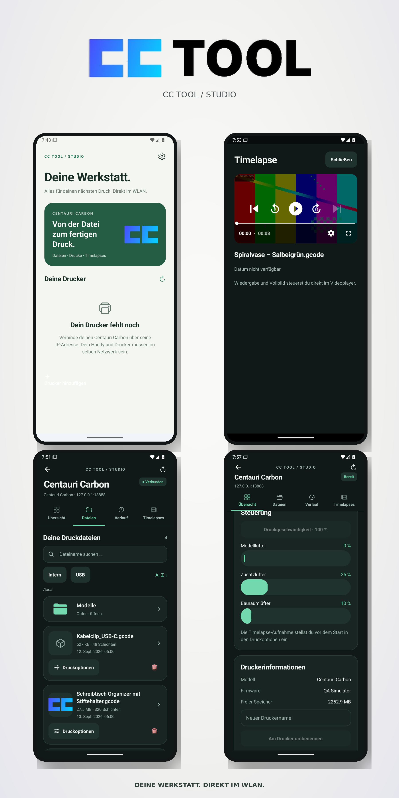

# CC Tool Mobile

Studio fork of [WalkerFrederick/CC-Tool](https://github.com/WalkerFrederick/CC-Tool), published by leonsuv.

**[Download the latest Android APK (2.2.0)](https://github.com/leonsuv/CC-Tool/releases/latest)** · [All releases](https://github.com/leonsuv/CC-Tool/releases)

Install the APK from release assets. Android 7+ on ARM32/ARM64. These builds use a development signing key, excluded from the repository. Versions 2.0.0 and 2.1.0 are archived binaries without preserved matching source snapshots; 2.1.1 is the first committed Studio source baseline. See `docs/releases/` for provenance and limitations.

## Studio 2.2.0 update

Internationalization (i18n) support: Full English and German translations for all screens, print options, controls, and timelapse playback. See [release notes](docs/releases/2.2.0.md).

## Studio 2.1.3 update

Fan sliders update locally without waiting for the printer. Commands are coalesced and limited to one request per second. Each fan also has an Ein/Aus control: above 0% it switches to 0%, at 0% it switches to 100%. See [release notes](docs/releases/2.1.3.md).

## Studio 2.1.2 update

Thick pill-shaped fan sliders; chamber light inside the camera card; tap-to-fullscreen camera with fitted, non-scrolling image, hidden system bars and compact close/light overlays. Nine automated tests pass; fullscreen and light controls checked with the emulator and simulated printer. See [release notes](docs/releases/2.1.2.md).

## Studio 2.1.1 update

Camera fullscreen releases the Android portrait lock (respects system auto-rotate) and restores portrait on exit. Chamber light is directly below the camera. Home temperature is labeled Bauraum; automatic leveling defaults to off. File-tab headings, padding and root breadcrumb are reduced to leave more room for files. Version code 10. Video behavior is unchanged.

## Studio 2.1.0 update

- Inline live camera above temperatures, persisted bandwidth-saving switch and fullscreen. The stream is unmounted when disabled, backgrounded or outside the overview.
- Three fan sliders send coalesced changes every 250 ms with a final value on release; requests remain ordered per fan.
- Timelapse Play uses the download path with progress/cancellation, saves offline and then plays locally. Video unlock now allows 120 seconds.
- Missing history thumbnails fall back to embedded G-code images, read sequentially using a bounded 256 KiB HTTP range. Failed history images try alternate matching history entries.
- Home cards show Chamber temperature and active-print progress; detail status/progress lives above the tabs, without the redundant green ready card.

Verified against a physical CC1: idle status, file/history responses, camera HTTP stream, video unlock/download, and embedded G-code thumbnail extraction. No print was started and no heater, motion or fan values were changed during hardware checks. Eight automated tests and TypeScript checks pass. APK uses version code 9.

## CC Tool Studio 2.0.0

Android redesign for the original Centauri Carbon (CC1), with German UI and light/dark themes.

- Files: actual `name`/`FileSize` fields, readable multiline names, search, date/name sorting, internal/USB storage and nested folders; separate confirmed deletion.
- Print setup: full filename/path, available size/layer/time metadata, automatic leveling, timelapse and start layer; current printer platform setting is preserved. Start waits for a fresh idle status and explicit user confirmation.
- History: command 320 followed automatically by batched 321 detail requests. Names, timestamps, duration, task outcome, layers, thumbnails, video state and reprint after checking the source file exists.
- Timelapses: command 323 unlock, native MP4 playback/fullscreen, progress and cancellation, persistent app-local download, Android share/export, offline playback after restart. Rendering/generating/deleted videos have explicit states.
- Overview: current job, pause/resume/cancel, temperature targets, separate fan percentages, speed, chamber light, camera and device metadata.
- Requests: unique IDs per command, multi-printer isolation, rejection and timeout feedback, stale-socket protection, partial status merging and reconnect on foreground.

### Build

Node, JDK 17 and Android SDK 35/NDK 27.1.12297006 are required.

```sh
npm ci
npx expo prebuild --platform android --no-install
# Configure ANDROID_HOME or android/local.properties for your SDK.
cd android
NODE_ENV=production ./gradlew :app:assembleRelease -PreactNativeArchitectures=arm64-v8a,armeabi-v7a
```

Output: `android/app/build/outputs/apk/release/app-release.apk`. Release includes its JavaScript bundle. No Metro server is required. Current source: version code 12, version 2.1.3; Android 7+ on ARM32/ARM64. Local prebuild creates a development keystore; it will not match the private local key used for published APKs. Configure your own release signing for redistribution.

### Verification

```sh
npx tsc --noEmit
node --test tests/*.test.cjs
```

Protocol/connection/download tests cover lowercase names, folder paths, history fields, media URLs, print payload validation, SDK statuses, independent printer responses, rejected start, reconnect cancellation, and Android filename decoding/invalid HTTP responses.

Android 15 emulator was used with `tests/mock-printer.cjs` (localhost only), using the installed release APK. Sample metadata and thumbnails in QA screenshots are simulated, not data from a real printer. Hardware compatibility has not been verified. Firmware-specific behavior may differ; unsupported commands report rejection instead of implying success.

### Protocol sources and compatibility

The starting references are [WalkerFrederick's CC1 notes](https://github.com/WalkerFrederick/sdcp-centauri-carbon) and [RemmyLee/carbon](https://github.com/RemmyLee/carbon). The lowercase file schema, nested history information and 403 settings were cross-checked against [pycentauri's protocol observations](https://github.com/bjan/pycentauri/blob/main/docs/PROTOCOL.md). Video unlock command 323 and the returned download path follow [Centauri-Carbon-Manager's implementation](https://github.com/J-Lindvig/Centauri-Carbon-Manager). Task outcomes/video states follow [CBD-Tech SDCP](https://github.com/cbd-tech/SDCP-Smart-Device-Control-Protocol-V3.0.0).

Print-state codes follow the newer Elegoo SDK mapping exposed by pycentauri: 6 paused, 8 stopped, 9 completed, 10 file checking. This deliberately replaces the conflicting early Walker observations. CC2's MQTT protocol is outside this build. G-code upload, firmware updates and generating timelapses from raw frames are not implemented. The app displays metadata only when the printer reports it; estimated time/filament values are not fabricated. Downloaded videos are stored inside the app; use Share to export before uninstalling.

Welcome to CC Tool!



## 📄 License

This project is licensed under the MIT License.
